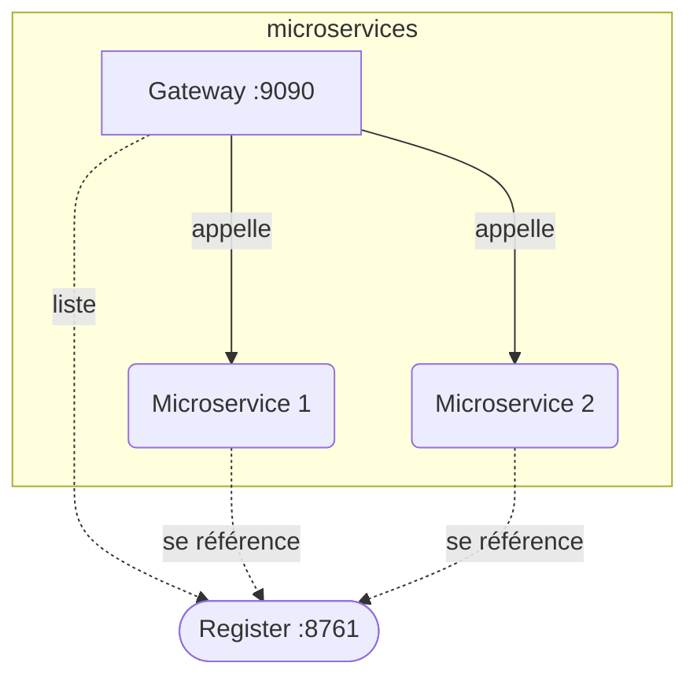

# Lab de construction et d'utilisation de microservices

## Pré-requis

* Docker
* docker-compose

## Lancement

```shell
docker compose up -d
```

## Supervision

http://localhost:8761


## Schéma


